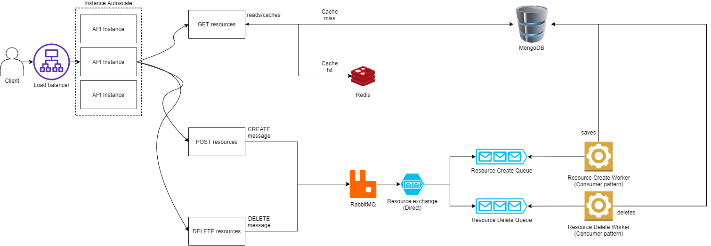

<p align="center"> </p>
<p align="center">

</p>

# Description

This repository was created as a solution for B2W Developer challenge.

> The API has an application-level rate limiter. It's currently configured to 100 requests per minute. and uses redis for client management.

## Architecture overview


To speed up requests, a cache layer was applied into READ-related requests (GET /planets).

Also, a queue was used with a strategy to segregate the *commands* (Writes) from *queries* (reads). By this way, we make requests faster, as there is no need to process business logic (This is done in the background, by workers).

For each resource (in this case, only planets resource), an exchange would be responsible for routing the message to the correct queue, so workers related to that queue can consume it's messages.


## The challenge

The following instructions were given in the test: (PT-BR)

```
Instruções gerais
Dando continuidade ao nosso processo, temos um desafio para te propor! \o/


Nossos associados são aficionados por Star Wars e com isso, queremos criar um jogo com algumas informações da franquia.


Para possibilitar a equipe de front criar essa aplicação, queremos desenvolver uma API que contenha os dados dos planetas.


Requisitos:

- A API deve ser REST

- Para cada planeta, os seguintes dados devem ser obtidos do banco de dados da aplicação, sendo inserido manualmente:


Nome

Clima

Terreno


- Para cada planeta também devemos ter a quantidade de aparições em filmes, que podem ser obtidas pela API pública do Star Wars: https://swapi.dev/about


Funcionalidades desejadas:

- Adicionar um planeta (com nome, clima e terreno)

- Listar planetas

- Buscar por nome

- Buscar por ID

- Remover planeta


Linguagem permitida no desafio: Node.JS


Bando de dados permitido: noSQL, preferencialmente MongoDB


E lembre-se!

Um bom software é um software bem testado;
Essa é a hora de mostrar o que você sabe, quanto mais caprichado, melhor!


May the force be with you!
```

# Requirements

## Docker

You can use [Docker Compose](https://docs.docker.com/compose/) to start the project.

> Ref: docker-compose version 1.28.5, build c4eb3a1f

## Manual

- Node: 16.3.0
- Redis: 6.2.4
- MongoDB

# Installing

Use `npm i` for installing node dependencies.

# Running

## NPM

```
npm run dev
```

## docker-compose

```
docker-compose up
```

# Swagger

There are OpenAPI-like specs defined at `docs/swagger.json`. When running the application structure, you can access `<host>/api-docs` to access swagger documentation.


# Codecrumbs

You can see a general structure and more info from project by using codecrumbs. There is a shortcut available at `npm run crumbs`.

# Testing

You can use `npm run test` or `npm run test:unit` to run unit tests and `npm run test:integration` to run integration tests.

> For code coverage use `npm run coverage`

# Auditting

`npm run audit`

# Credits

Darth Vader chibi from [dereklaufman](https://www.deviantart.com/dereklaufman/art/Chibi-Vader-578683250).
